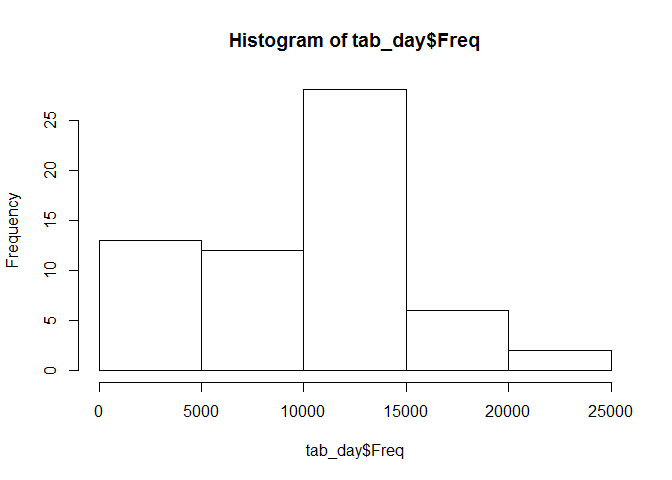
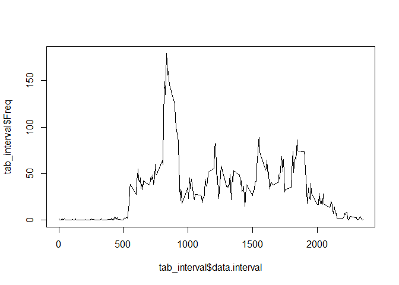
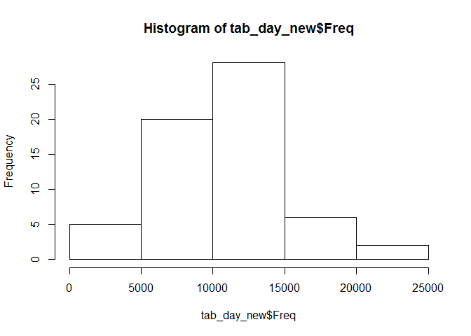
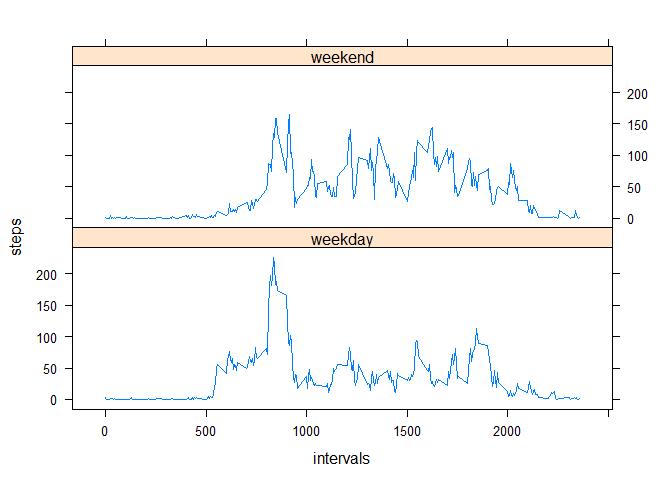

# Reproducible Research: Peer Assessment 1
=====================================================================

## Set locale

```r
Sys.setlocale("LC_ALL", "C")
```

```
## [1] "C"
```

## Change the working directory 
cd("C:/Users/llcc/RepData_PeerAssessment1")


## Loading and preprocessing the data
- loading the data into a data frame called "data"

```r
data <- read.csv("activity.csv")
```

- having a quick look at the data

```r
str(data)
```

```
## 'data.frame':	17568 obs. of  3 variables:
##  $ steps   : int  NA NA NA NA NA NA NA NA NA NA ...
##  $ date    : Factor w/ 61 levels "2012-10-01","2012-10-02",..: 1 1 1 1 1 1 1 1 1 1 ...
##  $ interval: int  0 5 10 15 20 25 30 35 40 45 ...
```


## What is mean total number of steps taken per day?
- Make a histogram of the total number of steps taken each day
aggregate the data frame by "date"

```r
tab_day <- data.frame(xtabs(data$steps ~ data$date))
head(tab_day)
```

```
##    data.date  Freq
## 1 2012-10-01     0
## 2 2012-10-02   126
## 3 2012-10-03 11352
## 4 2012-10-04 12116
## 5 2012-10-05 13294
## 6 2012-10-06 15420
```

make a histogram

```r
hist(tab_day$Freq)
```

 

## Calculate and report the mean and median total number of steps taken per day

```r
mean(tab_day$Freq)
```

```
## [1] 9354.23
```

```r
median(tab_day$Freq)
```

```
## [1] 10395
```

## What is the average daily activity pattern?
- Make a time series plot (i.e. type = "l") of the 5-minute interval (x-axis) and the average number of steps taken, averaged across all days (y-axis)

aggregate the data by time interval

```r
tab_interval <- data.frame(xtabs(data$steps ~ data$interval))
tab_interval$data.interval <- as.numeric(as.character(tab_interval$data.interval))
tab_interval$Freq <- tab_interval$Freq / 61
head(tab_interval)
```

```
##   data.interval       Freq
## 1             0 1.49180328
## 2             5 0.29508197
## 3            10 0.11475410
## 4            15 0.13114754
## 5            20 0.06557377
## 6            25 1.81967213
```

make the plot

```r
plot(tab_interval$data.interval,tab_interval$Freq, type="l")
```

 

- Which 5-minute interval, on average across all the days in the dataset, contains the maximum number of steps?

```r
max_step <- max(tab_interval$Freq)
tab_interval[tab_interval$Freq == max_step,]
```

```
##     data.interval     Freq
## 104           835 179.1311
```

## Imputing missing values
- Calculate and report the total number of missing values in the dataset (i.e. the total number of rows with `NA`s)

```r
length(data$steps[is.na(data$steps)])
```

```
## [1] 2304
```

-  Filling in all of the missing values with the mean for that 5-minute interval

```r
for(i in 1 : nrow(data)){
        if(is.na(data$steps[i])){
                data$steps[i] <- tab_interval[tab_interval$data.interval ==
                                                      data$interval[i], 2]
        }
}
```
test whether there still `NA`s in the data frame

```r
length(data$steps[is.na(data$steps)])
```

```
## [1] 0
```

- Create a new dataset that is equal to the original dataset but with the missing data filled in.

```r
newdata <- data
```

- Make a histogram of the total number of steps taken each day

aggregate the newdata by "date"

```r
tab_day_new <- data.frame(xtabs(newdata$steps ~ newdata$date))
head(tab_day_new)
```

```
##   newdata.date     Freq
## 1   2012-10-01  9354.23
## 2   2012-10-02   126.00
## 3   2012-10-03 11352.00
## 4   2012-10-04 12116.00
## 5   2012-10-05 13294.00
## 6   2012-10-06 15420.00
```

- make the histogram

```r
hist(tab_day_new$Freq)
```

 

- Calculate and report the **mean** and **median** total number of steps taken per day

```r
mean(tab_day_new$Freq)
```

```
## [1] 10581.01
```

```r
median(tab_day_new$Freq)
```

```
## [1] 10395
```

- Do these values differ from the estimates from the first part of the assignment? What is the impact of imputing missing data on the estimates of the total daily number of steps?

```r
mean(tab_day_new$Freq) - mean(tab_day$Freq)
```

```
## [1] 1226.784
```

```r
median(tab_day_new$Freq) - median(tab_day$Freq)
```

```
## [1] 0
```
It seems the `mean` has been impacted a lot, but the `median` has not been impacted at all.

## Are there differences in activity patterns between weekdays and weekends?

- Create a new factor variable in the dataset with two lev[els -- "weekday" and "weekend" indicating whether a given date is a weekday or weekend day.

First fetch the dates and change them to weekdays

```r
w <- weekdays(as.Date(as.character(newdata$date)))
head(w)
```

```
## [1] "Monday" "Monday" "Monday" "Monday" "Monday" "Monday"
```

Then change the `w`s to weekdays or weekends

```r
weekdayORweekend <- NULL
for(i in 1 : length(w)){
        if(w[i] == "Saturday" | w[i] == "Sunday"){
                weekdayORweekend[i] <- "weekend"
        }else{
                weekdayORweekend[i] <- "weekday"
        }
        
}
sum(weekdayORweekend == "weekend")
```

```
## [1] 4608
```

```r
sum(weekdayORweekend == "weekday")
```

```
## [1] 12960
```

Finally change `weekdayORweekend` into a factor and add it into the `newdata` data frame


```r
weekdayORweekend <- as.factor(weekdayORweekend)
newdata <- cbind(newdata, weekdayORweekend)
head(newdata)
```

```
##        steps       date interval weekdayORweekend
## 1 1.49180328 2012-10-01        0          weekday
## 2 0.29508197 2012-10-01        5          weekday
## 3 0.11475410 2012-10-01       10          weekday
## 4 0.13114754 2012-10-01       15          weekday
## 5 0.06557377 2012-10-01       20          weekday
## 6 1.81967213 2012-10-01       25          weekday
```


- Make a panel plot containing a time series plot (i.e. **type = "l"**) of the
5-minute interval (x-axis) and the average number of steps taken, averaged
across all weekday days or weekend days (y-axis).

aggregate the data by the `interval` and the `weekdayORweekend` 

```r
agg_data <- aggregate(newdata$steps, 
                      by = list(newdata$interval, 
                                newdata$weekdayORweekend),
                      FUN = mean)
str(agg_data)
```

```
## 'data.frame':	576 obs. of  3 variables:
##  $ Group.1: int  0 5 10 15 20 25 30 35 40 45 ...
##  $ Group.2: Factor w/ 2 levels "weekday","weekend": 1 1 1 1 1 1 1 1 1 1 ...
##  $ x      : num  2.2211 0.4393 0.1709 0.1953 0.0976 ...
```

make a plot with x-axis the `interval`s and y-axis the `steps`

```r
library(lattice)
xyplot(x ~ Group.1|Group.2,
       data = agg_data,
       type = "l",
       xlab = "intervals",
       ylab = "steps",
       layout = c(1,2))
```

 
